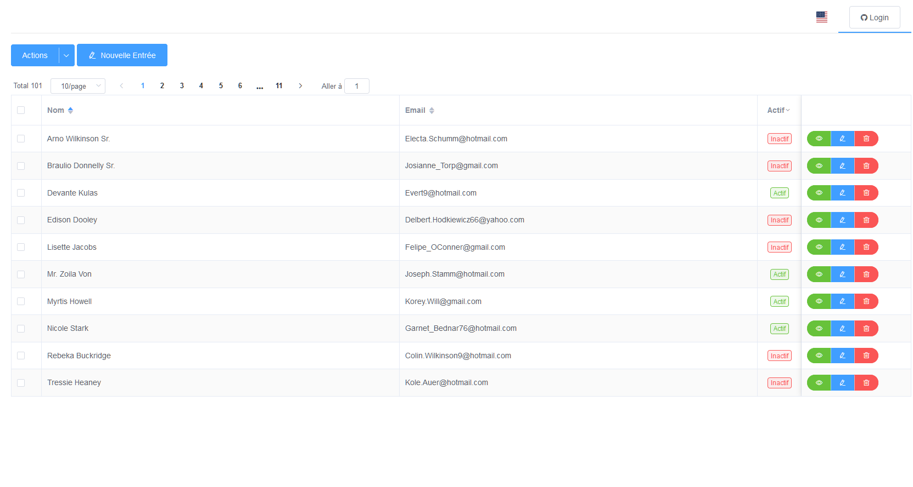

# Démonstration Vue.js / Element-ui

**Cette démonstration permet de gérer une table/collection avec les CRUD
(Create/Retrieve/Update/Delete) indispensables**

Une internationalisation Français/Anglais est également implémenté avec
[vue-i18n](https://github.com/kazupon/vue-i18n).

* [Démo](http://elementui-demo-table.surge.sh/)

## Produits utilisés

* [vue.js 2](http://vuejs.org)
* [element](http://element-cn.eleme.io/#/en-US/component/installation)
* [vue-i18n](https://github.com/kazupon/vue-i18n)
* [faker.js](https://github.com/marak/Faker.js/)
* [poi.js](http://poi.js.org)
* [vue-standalone-component](https://github.com/InCuca/vue-standalone-component)
* [surge.sh](http://surge.sh)

## Quelques informations sur cette démonstration

* Les données sont générés par Faker.js et ne sont reliés à aucun backend. Vous
  pouvez donc, éditer, supprimer ou créer autant que vous le souhaitez. Utilisez
  le bouton _Actions -> Recharger les données_ pour réinitialiser.

* Le login Github n'est relié à aucune action.

* Le projet est généré avec vue-cli et
  [vue-standalone-component](https://github.com/InCuca/vue-standalone-component)

* L'utilisation de [poi.js](http://poi.js.org) facilite grandement la gestion
  des projets nécessitant Webpack.

* Les traductions sont sommaires et incomplètes.

## TODO

* Régler le problème du changement de langue pour Element
* Tests
* Intégration de Firebase en version simplifié
* Faire une version responsive en PWA
* Chargement à la demande pour les composants element-ui
* Voir pourquoi norton déclenche une alerte sur chrome pour surge.sh et pas sur
  firefox
* Exploiter [styleguide](https://github.com/vue-styleguidist/vue-styleguidist)
  qui est pré-configuré ou voir [vue-play](https://github.com/vue-play/vue-play)

## License

This project is licensed under
[MIT License](http://en.wikipedia.org/wiki/MIT_License)
